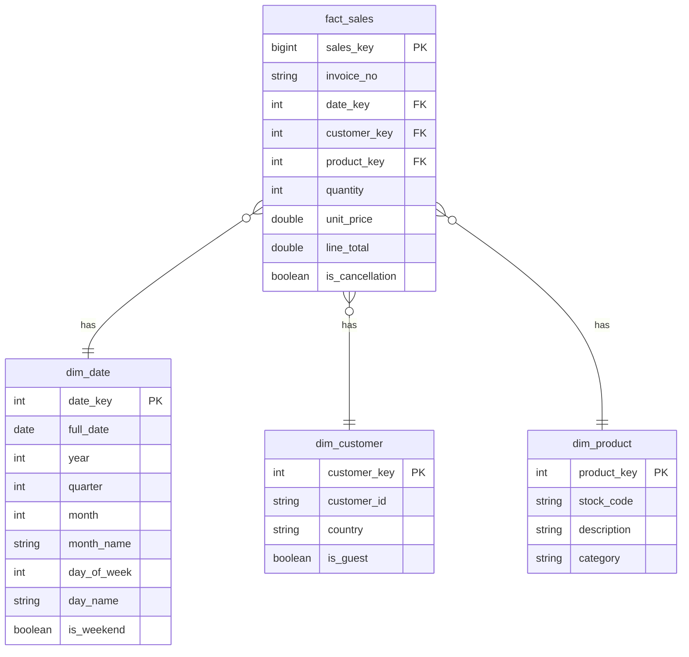

# Retail Sales Data Warehouse

A small end-to-end data warehousing project: synthetic e-commerce
transaction data is generated, loaded into a staging area, cleaned, and
transformed into a **star schema**, on top of which a set of analytical
SQL queries answer common business questions (revenue trends, top
products, customer cohorts, etc).

Built with **Python + DuckDB** so the entire pipeline runs locally with
no external database server or API keys required.

## Why synthetic data?

Rather than depending on an external dataset download (which can go
stale, be rate-limited, or require an account), this project includes a
generator (`scripts/generate_data.py`) that produces a realistic raw
transaction CSV modeled closely on the well-known "Online Retail"
style of dataset: invoices, stock codes, product descriptions,
quantities, prices, customer IDs, and countries. It deliberately injects
the same kinds of data-quality issues found in real retail exports
(order cancellations, missing customer IDs / guest checkouts, bad
price/quantity rows, duplicate rows) so the ETL step has genuine
cleaning work to do, just like with real-world data.

## Architecture

```
generate_data.py  -->  data/raw_sales.csv
                              |
                              v
                     etl.py (staging -> clean -> star schema)
                              |
                              v
                      warehouse.duckdb
                              |
                              v
                    run_analysis.py (sql/analysis.sql)
                              |
                              v
                       output/*.csv
```

## Star schema



`fact_sales` holds one row per cleaned order line, with measures
`quantity`, `unit_price`, and the derived `line_total`. The three
dimension tables (`dim_date`, `dim_customer`, `dim_product`) provide the
descriptive attributes used to slice and dice the fact table.

## Project structure

```
retail-dw/
├── data/
│   └── raw_sales.csv          # generated raw transactional data
├── sql/
│   ├── schema.sql              # star schema DDL
│   └── analysis.sql            # 8 labeled analytical queries
├── scripts/
│   ├── generate_data.py        # synthetic raw data generator
│   ├── etl.py                  # staging -> clean -> star schema
│   └── run_analysis.py         # runs analysis.sql, exports CSVs
├── output/                     # query results (generated)
├── warehouse.duckdb            # the warehouse itself (generated)
├── requirements.txt
└── README.md
```

## How to run

```bash
pip install -r requirements.txt

# 1. Generate the raw transactional data
python scripts/generate_data.py

# 2. Build the warehouse (staging -> cleaning -> star schema)
python scripts/etl.py

# 3. Run the analytical queries and export results to output/
python scripts/run_analysis.py
```

You can also open `warehouse.duckdb` directly with the DuckDB CLI or
DBeaver and run any query from `sql/analysis.sql` interactively.

## ETL steps (`scripts/etl.py`)

1. **Extract / Load** — the raw CSV is loaded as-is into `staging_sales`.
2. **Clean**
   - Exact duplicate rows are removed.
   - Rows with a unit price of zero or less (data entry errors) are dropped.
   - Negative quantities are kept where they represent legitimate
     cancellations (`InvoiceNo` starting with `C`).
3. **Transform**
   - `dim_customer` is built from distinct customer IDs; missing IDs are
     mapped to a single `UNKNOWN` row and flagged with `is_guest = TRUE`.
   - `dim_product` is built from distinct stock codes, with a `category`
     derived from keyword matching on the product description.
   - `dim_date` is a fully generated calendar dimension covering the
     date range present in the data.
   - `fact_sales` joins the cleaned staging rows to their surrogate keys
     and computes `line_total = quantity * unit_price`.

## Analytical queries (`sql/analysis.sql`)

| Query | Description |
|---|---|
| `monthly_revenue` | Revenue and order count by month |
| `top_products` | Top 10 products by revenue |
| `revenue_by_category` | Revenue, units sold, and orders per product category |
| `revenue_by_country` | Top 10 countries by revenue |
| `sales_by_day_of_week` | Revenue pattern across days of the week |
| `customer_cohorts` | Monthly cohort retention analysis |
| `top_customers` | Top 10 customers by lifetime value |
| `cancellation_overview` | Overall order cancellation rate |

Each query is labeled with a `-- @name: query_name` comment so
`run_analysis.py` can parse and run them individually, printing a
preview and exporting the full result set to `output/<name>.csv`.

## Possible extensions

- Swap DuckDB for PostgreSQL or a cloud warehouse (BigQuery / Snowflake)
  — the schema and queries are standard ANSI SQL and need minimal changes.
- Add a slowly changing dimension (Type 2) for `dim_customer` to track
  changes in country/segment over time.
- Add a BI layer (Metabase / Power BI) on top of `warehouse.duckdb`.
- Schedule the pipeline with a tool like dbt or Airflow.

## Tech stack

- **Python 3** — orchestration and synthetic data generation
- **DuckDB** — embedded analytical database (the "warehouse")
- **pandas** — used for exporting query results to CSV
- **Faker** — used to generate randomized but realistic-looking values
